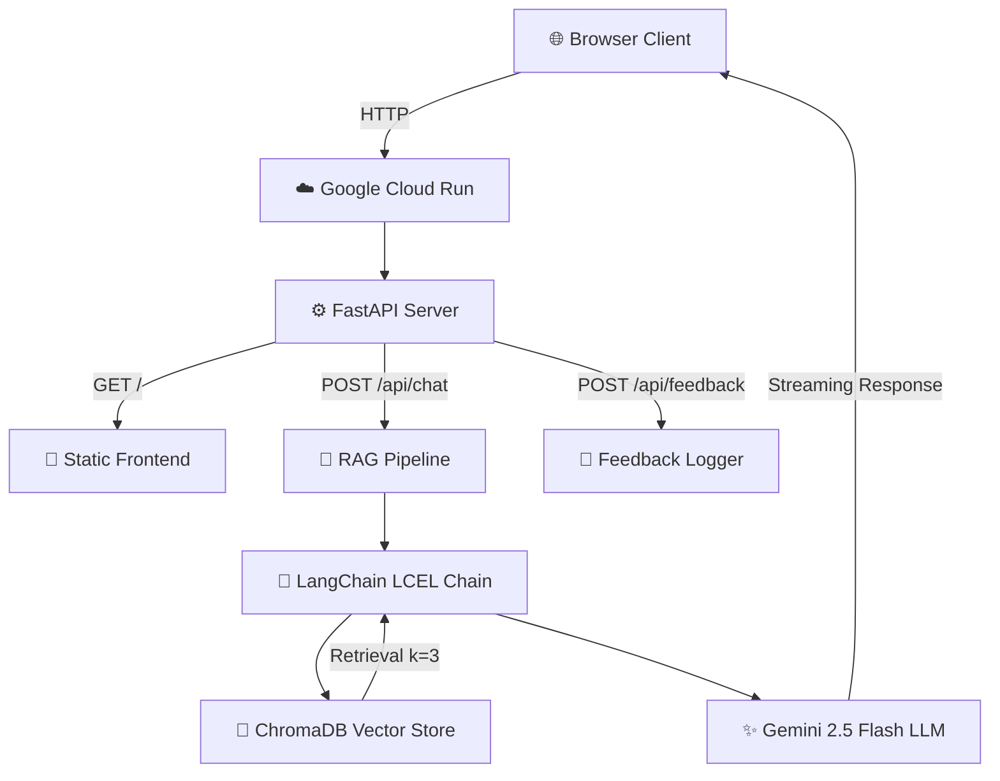

# 🌌 NG Bot Portfolio — System Report

**Codename:** Portfolio Multiverse  
**Version:** Beta V0.9.8  
**Author:** Vivekananda Bharupati  
**Live URL:** [https://portfolio-v1-33825043229.us-central1.run.app](https://portfolio-v1-33825043229.us-central1.run.app)  
**Repository:** [github.com/vivekanandab/portfolio-V0.9](https://github.com/vivekanandab/portfolio-V0.9)  

---

## 📌 1. Executive Summary

The NG Bot Portfolio is a fully containerized, AI-powered personal portfolio designed around a **cyber-terminal / HUD aesthetic**. It functions as both a visual showcase and a live AI system — visitors can browse an immersive interface of career history, projects, certifications, and media, or directly query an embedded RAG-based chatbot ("NG Bot") that answers questions about the portfolio owner's skills, experience, and projects using real-time document retrieval.

The entire system is deployed as a single **Google Cloud Run** container running a **FastAPI** backend that serves both the static frontend and the AI chat API. 🚀

---

## 🎨 2. Design Philosophy

| Principle | Implementation |
|-----------|---------------|
| 🎭 **Persona-driven UX** | Every module uses Sys-Admin / Arcane Developer terminal language ("INITIALIZE_LINK", "ACCESS_DB", "CORRUPTED SECTOR") |
| 🔧 **No frameworks, no compromises** | Pure Vanilla HTML/CSS/JS frontend — zero React, zero Tailwind, zero build tools |
| 📐 **1400px Unibody constraint** | All modules share a fixed max-width container with unified border, backdrop-filter, and color system |
| 🌑 **Dark-first immersion** | Black/cyan/magenta/gold palette with glassmorphism, glow effects, and scan-line animations |
| ⚡ **Interactivity over decoration** | Every section has hover states, click handlers, reveal mechanics, or scroll-driven animations |
| ☁️ **Stateless architecture** | No database writes on Cloud Run; RAG uses pre-embedded ChromaDB, media served via YouTube thumbnails |

---

## 🏗️ 3. Architecture



### 🛠️ Tech Stack

| Layer | Technology |
|-------|-----------|
| 🖥️ **Frontend** | HTML5, Vanilla CSS, Vanilla JavaScript |
| ⚙️ **Backend** | Python 3.11, FastAPI, Uvicorn |
| 🤖 **AI/ML** | LangChain (LCEL), Gemini 2.5 Flash, GoogleGenerativeAIEmbeddings |
| 💾 **Vector DB** | ChromaDB (persisted locally, shipped in container) |
| 🔤 **Fonts** | Google Fonts — Cinzel (display), Poppins (body) |
| 🎯 **Icons** | Font Awesome 6.4 |
| 📦 **Container** | Docker (python:3.11-slim-bookworm) |
| ☁️ **Hosting** | Google Cloud Run (us-central1) |
| 📬 **Contact** | Formspree |
| 🎬 **Media** | YouTube thumbnails via `img.youtube.com` (zero storage cost) |

---

## 🧩 4. Module Breakdown

The portfolio consists of **12 modules**, each self-contained with its own `view.html`, `style.css`, and `script.js`, dynamically loaded into `index.html` via JavaScript `fetch()` calls.

---

### 🌠 Module 01 — Galaxy Intro
**Purpose:** Animated star-field entry screen rendered on `<canvas>`. Acts as a cinematic loading gate before the main interface reveals.  
**Key Feature:** Transition flash effect on entry. Greetings in 14 languages rotate on screen.

---

### 🎮 Module 02 — Profile Bio `// BIO_METRICS`
**Color:** Green (`rgba(0, 255, 64)`)  
**Layout:** Two-panel — photo stack (left) + player card (right)

**Left Panel:**
- 🖼️ 4-image photo stack with CSS-driven slideshow
- 🔴 Animated HUD ring around avatar
- 🏅 Level badge (`LVL. 25` — M.S. completed)
- 📊 4 stat bars: Logic (90%), Creativity (85%), Spirit (70%), Discipline (RNG/glitch)
- 🎯 2 trait cards with hover tooltips

**Right Panel:**
- 👤 Player name with click-to-reveal alias ("nanda gadu")
- 💬 Signature quote: *"My code has logic, but my life has a screenplay."*
- 🧙 Class designation: "Arcane Developer"
- 🔗 2×2 social grid (LinkedIn, Kaggle, YouTube, Email)
- 📝 Bio text (3 paragraphs covering data science, gaming, AI/cloud)
- 🏷️ Tech badge row (Python, GCP, FastAPI, XGBoost, PyTorch, SQL)
- 💪 Fitness status Easter egg
- 🎬 4 action buttons (Programmer → GitHub, Editor → YouTube, Spiritual → PDF, Binge Watcher → txt)

---

### 📡 Module 02b — Experience `// SYS_DIAGNOSTIC`
**Color:** Cyan (`#00FFFF`)  
**Layout:** Two-panel — radar display (left) + career terminal (right)

**Left Panel:**
- 🛰️ Animated CSS radar sweep with grid overlay
- 📟 CPU/MEM/NET stats (absolute-positioned)
- 💻 Console output lines (instant render, no delay)

**Right Panel:**
- 🏷️ Dynamic header: "CAREER PROTOCOL" → updates to show selected role name
- 🔘 Role selector buttons: `[01] JUNIOR DATA SCIENTIST`, `[02] TECHNICAL INTERN`
- ❌ Clear/Reset button
- 💤 Default state: *"AWAITING FIELD DEPLOYMENT INITIATIVE"*
- 📋 Each role expands with company, dates, and 4–5 quantified bullet points
- 🔒 All content in a non-scrolling bounded terminal window

---

### 🗄️ Module 03 — Projects `// ARCHIVE_LOGS`
**Color:** Gold (`#FFD700`)  
**Layout:** Left sidebar (project selector thumbnails) + right detail panel

**Projects:**
1. 🕷️ **Intelligent Web Scraper** — Tag: `ML / NLP`
2. ☁️ **Cloud-Native ML Portfolio** — Tag: `CLOUD / ML`
3. 📊 **GrabOn Insight Engine** — Tag: `DATA ENG`

Each includes: objective paragraph, 4 technical bullet points, and 2–3 action buttons (GitHub, YouTube Demo, Detailed Report). 🔗

---

### 🧱 Module 04 — Mini Scripts `// MINI_CONSTRUCTS`
**Color:** Magenta (`#FF00FF`)  
**Layout:** Left grid panel (Cyber Wall) + right inspector panel

**Cyber Wall Grid:**
- 🧱 28 clickable bricks (4×7 or 7×4 depending on screen)
- ✅ 15 "safe" bricks → reveal project name + icon with pop animation
- 💣 13 "trap" bricks → trigger "CORRUPTED SECTOR" glitch
- 🔬 Projects span: Linear Regression, NumPy, Time Series, Salary EDA, Data Entry, Twitter Bot, Auto Swipe, Cookie Clicker, Spotify API, Flight Alert, NLP Workout, Stock Monitor, Rain Alert, ISS Tracker, Flash Card App

**Inspector Panel:**
- 🔒 Locked state → "SYSTEM LOCKED — AWAITING INPUT"
- 💥 Trap state → Bomb icon + "Security trigger activated"
- ✨ Safe state → Project title, tech tag, description, and GitHub link

---

### 📜 Module 05 — Certifications `// CREDENTIALS`
**Color:** White (`#ffffff`)  
**Layout:** Header logo row + expandable PDF viewer + skills footer

**Certificates (5):**
1. ☁️ Google Cloud Platform Fundamentals
2. 🐍 Using Python for Automation
3. 🧠 AI for Everyone
4. 📐 Foundational Math for Machine Learning
5. 💯 100 Days of Code

**Interaction:** Hover over a logo → PDF loads in embedded iframe, dynamic skill tags populate below. 🎯

---

### 🔮 Module 06 — Holo Console `// CHRONO_DECK_V4`
**Color:** Blue (`#0099ff`)  
**Layout:** Left visual slider + right timeline stream

**Left Panel — Visual Deck:**
- 🎠 4-slide carousel with AR-style HUD overlays
- 📸 Slides: Lexis Club, CodeOHolics, J.P. Morgan Forage, Skyscanner Forage
- 📊 Each slide: image, meta tags, expandable info plate with stats + action link

**Right Panel — Chrono Stream:**
- 📏 Vertical timeline rail with glowing green progress indicator
- 📌 Pinned intro block with system log
- 📄 "about_the_architect.pdf" document card
- 🎬 Timeline spans **2019–2026** with **25+ YouTube video cards**
- 🔵 Year dot anchors with active-state highlighting
- 🔗 All links open in new tabs
- ⏹️ Stream footer: *"// END OF ARCHIVE //"*

---

### 🎵 Module 07 — Inspiration Rail `// INSPIRATION_STREAM`
**Color:** Orange (`#ff6600`)  
**Layout:** Infinite horizontal auto-scrolling carousel ♾️

**Cards (13):**
- 🎬 **Movies:** Bahubali, RRR, Hanuman, Dhurandhar
- ⚔️ **Anime:** One Piece, Solo Leveling
- 👤 **Handles:** Sadhguru, MrBeast, The Food and Plate Affair
- 🎶 **Songs:** Madhurashtakam, Sri Venkateswara Stotram
- 💜 **Special:** "Special Person" Easter egg (Your Name artwork, non-clickable, pink heart)
- ℹ️ **Info card:** Introduction separator

**Animation:** CSS-driven infinite scroll with cloned track for seamless loop.

---

### 📡 Module 08 — Contact `// FINAL_TRANSMISSION`
**Color:** Red (`#ff3333`)  
**Layout:** Two-panel — resume download (left) + contact form (right)

**Left Panel:**
- 💎 Holographic chip animation for RESUME.PDF
- ⬇️ Download button with glitch text + progress bar animation
- 🔗 Social nodes: LinkedIn, GitHub, Email

**Right Panel:**
- 💻 Terminal-styled contact form (Formspree integration)
- 📝 Fields: SENDER_ID, RETURN_ADDRESS, DATA_PACKET
- 📡 TRANSMIT_SIGNAL submit button

---

### 🦶 Module 09 — Footer
`© 2026 Vivekananda Bharupati. All Systems Nominal.`

---

### ⚙️ Module 10 — Integration
JavaScript orchestration layer handling module loading, scroll animations, and inter-module communication.

---

### 🤖 Module 11 — NG Bot RAG Terminal
**Position:** Fixed bottom-right overlay (persistent across all sections)

**Features:**
- 📎 Minimizable via `_` button
- ⚡ Real-time streaming responses (ReadableStream)
- 🧠 Session-based conversation history (in-memory)
- 👍👎 Feedback system (thumbs up/down)
- ⌨️ Query input with EXECUTE button
- 🤖 Persona: "NG Bot (Nanda Gadi Bot)" — answers from RAG context only

**AI Pipeline:**
1. 💬 User question → ChromaDB retriever (k=3 nearest documents)
2. 🔗 Retrieved context + chat history → Gemini 2.5 Flash via LangChain LCEL
3. ✨ Streamed response chunks → rendered character-by-character in terminal

---

## ☁️ 5. Cloud Infrastructure

| Component | Detail |
|-----------|--------|
| 🏷️ **Service** | `portfolio-v1` |
| 📍 **Region** | `us-central1` |
| 🔄 **Revision** | `portfolio-v1-00006-bff` |
| 🐳 **Base Image** | `python:3.11-slim-bookworm` |
| 🔌 **Port** | `8080` (dynamic via `$PORT`) |
| 🔓 **Auth** | Public (allow-unauthenticated) |
| 🔑 **Env Vars** | `GOOGLE_API_KEY` (injected at deploy-time) |
| 📈 **Scaling** | 0→N (scales to zero when idle) |

---

## 📂 6. Repository Structure (GitHub)

```
Portfolio_Multiverse/
├── index.html                    # 🏠 Entry point — loads all modules
├── style.css                     # 🎨 Global styles (377 lines)
├── script.js                     # ⚙️ Master JS controller (876 lines)
├── main.py                       # 🐍 FastAPI server + RAG pipeline (134 lines)
├── ingest.py                     # 💾 Document ingestion into ChromaDB
├── requirements.txt              # 📦 Python dependencies (10 packages)
├── structure.txt                 # 🗺️ Project structure reference
│
├── modules/
│   ├── 01_galaxy_intro/          # 🌠 Canvas starfield entry
│   ├── 02_profile_bio/           # 🎮 Player card + stat bars
│   ├── 02b_experience/           # 📡 Radar + career terminal
│   ├── 03_projects_main/         # 🗄️ Project archive viewer
│   ├── 04_mini_scripts/          # 🧱 Cyber Wall brick grid
│   ├── 05_certifications/        # 📜 PDF viewer + skill tags
│   ├── 06_holo_console/          # 🔮 Visual deck + timeline stream
│   ├── 07_recs_rail/             # 🎵 Infinite scroll carousel
│   ├── 08_transmission/          # 📡 Resume download + contact form
│   ├── 09_footer/                # 🦶 Footer
│   ├── 10_integration/           # ⚙️ Module orchestration
│   └── 11_rag_terminal/          # 🤖 AI chatbot terminal
│
└── assets/
    ├── audio/                    # 🔊 Sound effects (pop, whoosh)
    ├── certs/                    # 📜 PDF certificates + thumbnails
    ├── documents/                # 📄 Resume, About, Spirituality
    ├── icons/                    # 🎯 Logo, NG Bot avatar, tech icons
    └── images/                   # 🖼️ Profile photos, thumbnails, timeline media
```

> Each module contains up to 3 files: `view.html`, `style.css`, `script.js`

---

## 📊 7. Metrics

| Metric | Value |
|--------|-------|
| 🧩 Total HTML modules | 12 |
| 🎨 Total CSS files | 10 (~3,400 lines combined) |
| ⚙️ Master JS controller | 876 lines |
| 🤖 RAG terminal JS | ~200 lines |
| 🐍 Python backend | 134 lines |
| 🧱 Grid elements (Module 04) | 28 bricks |
| 🎬 Timeline cards (Module 06) | 25+ entries across 8 years |
| 🎵 Inspiration items (Module 07) | 13 cards |
| 📜 Certifications | 5 with live PDF preview |
| 🎠 Carousel slides (Module 06) | 4 activity slides |
| ⏱️ Container cold start | ~15 seconds |

---

## 🗺️ 8. Roadmap (Post V0.9.8)

| Priority | Feature | Status |
|----------|---------|--------|
| 1️⃣ | Custom domain mapping (`.tech` / `.cloud`) | 📋 Planned |
| 2️⃣ | Light / Professional theme toggle (V2) | 📋 Planned |
| 3️⃣ | Module 04 → Functional applet dashboard | 📋 Planned |
| 4️⃣ | Planetary navigation system (V3) | 💭 Concept |
| 5️⃣ | Persistent feedback via Firestore | 📋 Planned |
| 6️⃣ | CI/CD via GitHub Actions | 📋 Planned |
| 7️⃣ | Mobile-first responsive overhaul | 🔄 In Progress |

---

> *"My code has logic, but my life has a screenplay."* 🎬  
> — Vivekananda Bharupati
