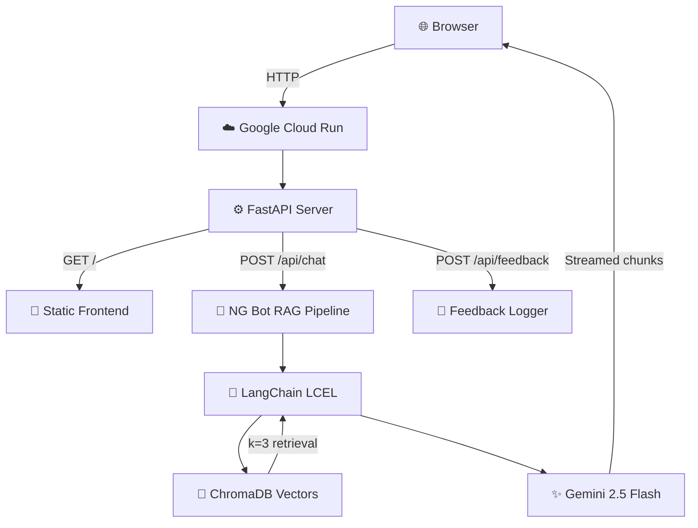

# 🌌 Portfolio Multiverse
**Version:** Beta V0.9.8  
**Author:** Vivekananda Bharupati  
**Live URL:** [https://portfolio-v1-33825043229.us-central1.run.app](https://portfolio-v1-33825043229.us-central1.run.app)  
**Repository:** [github.com/vivekanandab/portfolio-V0.9](https://github.com/vivekanandab/portfolio-V0.9)  

---

## 📌 1. What Is This?

This is a **cloud-hosted, AI-integrated personal portfolio** built to showcase engineering skills in Machine Learning, Data Science, and Cloud Architecture. It doesn't just *describe* what I can build — it *is* what I can build.

The portfolio itself serves as a living proof-of-concept:
- 🧠 **AI/ML Skills** → An embedded RAG chatbot ("NG Bot") powered by LangChain + Gemini demonstrates real-time document retrieval and conversational AI
- ☁️ **Cloud Engineering** → The entire application is containerized and deployed on **Google Cloud Run**, proving production-grade DevOps capability
- 🎨 **Frontend Engineering** → A custom cyber-terminal UI built entirely in **Vanilla HTML/CSS/JS** (zero frameworks) showcases deep CSS architecture and DOM manipulation skills
- 🐍 **Backend Engineering** → A FastAPI server handles both static file serving and async AI streaming endpoints in a single container

> The portfolio is the product. Every module is an engineering demonstration. NG Bot is one feature among many.

---

## 🎨 2. Design Philosophy

| Principle | Implementation |
|-----------|---------------|
| 🎭 **Persona-driven UX** | Cyber-terminal / HUD aesthetic — every label, button, and status uses Sys-Admin language |
| 🔧 **Zero dependencies** | Pure Vanilla HTML/CSS/JS — no React, no Tailwind, no build tools |
| 📐 **1400px Unibody** | All modules share a fixed max-width container with unified border and color system |
| 🌑 **Dark-first immersion** | Black/cyan/magenta/gold palette with glassmorphism and scan-line animations |
| ⚡ **Interactive everything** | Hover states, click reveals, scroll animations, and grid mechanics in every section |
| ☁️ **Cloud-native** | Stateless architecture, containerized deployment, scales to zero when idle |

---

## 🏗️ 3. Architecture



### 🛠️ Tech Stack

| Layer | Technology |
|-------|-----------|
| 🖥️ **Frontend** | HTML5, Vanilla CSS, Vanilla JavaScript |
| ⚙️ **Backend** | Python 3.11, FastAPI, Uvicorn |
| 🤖 **AI Feature** | LangChain (LCEL), Gemini 2.5 Flash, GoogleGenerativeAIEmbeddings, ChromaDB |
| 📦 **Container** | Docker (python:3.11-slim-bookworm) |
| ☁️ **Hosting** | Google Cloud Run (us-central1, scales 0→N) |
| 📬 **Contact** | Formspree |
| 🎬 **Media** | YouTube thumbnail CDN (zero storage cost) |
| 🔤 **Typography** | Google Fonts — Cinzel + Poppins |
| 🎯 **Icons** | Font Awesome 6.4 |

---

## 🧩 4. Module Breakdown

12 self-contained modules, each with `view.html`, `style.css`, and `script.js`, dynamically loaded via `fetch()`.

---

### 🌠 Module 01 — Galaxy Intro
Animated `<canvas>` star-field entry gate. Greetings in 14 languages rotate before the main interface reveals with a cinematic flash transition.

---

### 🎮 Module 02 — Player Profile `// BIO_METRICS`

| Left Panel | Right Panel |
|------------|-------------|
| 🖼️ 4-image photo slideshow | 👤 Player name + hidden alias reveal |
| 🔴 HUD ring + Level badge (LVL. 25) | 💬 Signature quote |
| 📊 4 stat bars (Logic/Creativity/Spirit/Discipline) | 🧙 Class: "Arcane Developer" |
| 🎯 2 trait cards with tooltips | 🔗 Social grid (LinkedIn, Kaggle, YouTube, Email) |
| | 📝 3-paragraph bio + tech badges |
| | 💪 Fitness Easter egg |
| | 🎬 4 action buttons (GitHub, YouTube, Philosophy, Watchlist) |

---

### 📡 Module 02b — Experience `// SYS_DIAGNOSTIC`

| Left Panel | Right Panel |
|------------|-------------|
| 🛰️ Animated radar sweep | 🏷️ Dynamic header updates on role selection |
| 📟 CPU/MEM/NET live stats | 🔘 2 role buttons + ❌ clear/reset |
| 💻 Instant console output | 📋 Quantified bullet points per role |
| | 🔒 Non-scrolling bounded terminal |

**Roles:** Junior Data Scientist (Husle, June 2023–June 2024) · Technical Intern (Husle, Jan 2022–June 2023)

---

### 🗄️ Module 03 — Projects `// ARCHIVE_LOGS`
Left sidebar thumbnails → right detail panel with expandable project cards.

| # | Project | Tag | Action Buttons |
|---|---------|-----|----------------|
| 1 | 🕷️ Intelligent Web Scraper | `ML / NLP` | GitHub, YouTube |
| 2 | ☁️ Cloud-Native ML Portfolio | `CLOUD / ML` | GitHub, YouTube, Report |
| 3 | 📊 GrabOn Insight Engine | `DATA ENG` | GitHub, YouTube |

Each: objective paragraph + 4 technical bullet points.

---

### 🧱 Module 04 — Cyber Wall `// MINI_CONSTRUCTS`
**28 clickable bricks** in a grid (4×7). 15 reveal mini-projects with icons + descriptions. 13 are traps that trigger a "CORRUPTED SECTOR" glitch animation. 💣

Projects include: Linear Regression, NumPy N-Dim, Time Series, Twitter Bot, Spotify API, Flight Alert, ISS Tracker, Stock Monitor, and more.

---

### 📜 Module 05 — Certifications `// CREDENTIALS`
5 certificates with **live PDF preview** on hover. Dynamic skill tags auto-populate below the viewer.

☁️ GCP Fundamentals · 🐍 Python Automation · 🧠 AI for Everyone · 📐 Math for ML · 💯 100 Days of Code

---

### 🔮 Module 06 — Activities & Timeline `// CHRONO_DECK_V4`

| Left — Visual Deck | Right — Chrono Stream |
|--------------------|-----------------------|
| 🎠 4-slide AR carousel | 📏 Vertical timeline rail with glow progress |
| 📸 Lexis Club, CodeOHolics, J.P. Morgan, Skyscanner | 📌 Pinned intro + about_the_architect.pdf |
| 🔗 Expandable info plates with stats | 🎬 **25+ YouTube videos** spanning 2019–2026 |
| | 🔵 Year anchors with active highlighting |

All external links open in new tabs. ✅

---

### 🎵 Module 07 — Inspiration Rail `// INSPIRATION_STREAM`
♾️ Infinite auto-scrolling horizontal carousel with **13 cards:**

🎬 Movies (Bahubali, RRR, Hanuman, Dhurandhar) · ⚔️ Anime (One Piece, Solo Leveling) · 👤 Handles (Sadhguru, MrBeast, Food & Plate Affair) · 🎶 Songs (Madhurashtakam, Venkateswara Stotram) · 💜 "Special Person" Easter egg

---

### 📡 Module 08 — Contact `// FINAL_TRANSMISSION`

| Left | Right |
|------|-------|
| 💎 Holographic RESUME.PDF chip | 💻 Terminal-styled Formspree contact form |
| ⬇️ Glitch download button | 📝 SENDER_ID / RETURN_ADDRESS / DATA_PACKET |
| 🔗 LinkedIn, GitHub, Email nodes | 📡 TRANSMIT_SIGNAL submit |

---

### 🦶 Module 09 — Footer
`© 2026 Vivekananda Bharupati. All Systems Nominal.`

---

### ⚙️ Module 10 — Integration
Orchestration layer: module loading, scroll triggers, inter-module communication.

---

### 🤖 Module 11 — NG Bot (RAG Feature)
A **persistent bottom-right terminal** that proves real-world RAG engineering skills:

- ⚡ Streaming responses via `ReadableStream`
- 🧠 Session-based memory (LangChain `ChatMessageHistory`)
- 💾 ChromaDB retrieval (k=3 nearest document chunks)
- ✨ Gemini 2.5 Flash generation with custom system persona
- 👍👎 Feedback loop logging

> This isn't just a chatbot widget — it's a production RAG pipeline (LangChain LCEL → ChromaDB → Gemini) running inside a containerized FastAPI app on Cloud Run. It exists to demonstrate that I can architect, build, and deploy AI systems end-to-end.

---

## ☁️ 5. Deployment

| Component | Detail |
|-----------|--------|
| 🏷️ **Service** | `portfolio-v1` |
| 📍 **Region** | `us-central1` |
| 🔄 **Revision** | `portfolio-v1-00006-bff` |
| 🐳 **Image** | `python:3.11-slim-bookworm` |
| 🔌 **Port** | `8080` (dynamic `$PORT`) |
| 🔓 **Access** | Public (unauthenticated) |
| 🔑 **Secrets** | `GOOGLE_API_KEY` injected at deploy-time |
| 📈 **Scaling** | 0→N (zero cost when idle) |

---

## 📂 6. Repository Structure

```
Portfolio_Multiverse/
├── index.html                    # 🏠 Entry point
├── style.css                     # 🎨 Global styles (377 lines)
├── script.js                     # ⚙️ Master controller (876 lines)
├── main.py                       # 🐍 FastAPI + RAG pipeline (134 lines)
├── ingest.py                     # 💾 ChromaDB document ingestion
├── requirements.txt              # 📦 10 Python packages
│
├── modules/                      # 🧩 12 self-contained UI modules
│   ├── 01_galaxy_intro/          # 🌠 Canvas starfield
│   ├── 02_profile_bio/           # 🎮 Player card + stats
│   ├── 02b_experience/           # 📡 Radar + career terminal
│   ├── 03_projects_main/         # 🗄️ Project archive
│   ├── 04_mini_scripts/          # 🧱 Cyber Wall grid
│   ├── 05_certifications/        # 📜 PDF viewer + skills
│   ├── 06_holo_console/          # 🔮 Activity deck + timeline
│   ├── 07_recs_rail/             # 🎵 Infinite scroll carousel
│   ├── 08_transmission/          # 📡 Resume + contact form
│   ├── 09_footer/                # 🦶 Footer
│   ├── 10_integration/           # ⚙️ Orchestration
│   └── 11_rag_terminal/          # 🤖 AI chatbot
│
└── assets/
    ├── audio/                    # 🔊 Sound effects
    ├── certs/                    # 📜 Certificates + thumbnails
    ├── documents/                # 📄 Resume, philosophy, watchlist
    ├── icons/                    # 🎯 Logos, tech icons, greetings
    └── images/                   # 🖼️ Photos, thumbnails, timeline media
```

---

## 📊 7. By The Numbers

| Metric | Value |
|--------|-------|
| 🧩 UI Modules | 12 |
| 🎨 CSS (combined) | ~3,400 lines |
| ⚙️ JavaScript (combined) | ~1,100 lines |
| 🐍 Python backend | 134 lines |
| 🧱 Cyber Wall bricks | 28 |
| 🎬 Timeline entries | 25+ across 8 years |
| 🎵 Inspiration cards | 13 |
| 📜 Live PDF certificates | 5 |
| 🎠 Activity slides | 4 |
| 📦 Python dependencies | 10 |

---

## 🗺️ 8. What's Next

| Priority | Feature | Status |
|----------|---------|--------|
| 1️⃣ | Custom domain (`.tech` / `.cloud`) | 📋 Planned |
| 2️⃣ | Light / Professional theme (V2) | 📋 Planned |
| 3️⃣ | Functional applet dashboard (Module 04) | 📋 Planned |
| 4️⃣ | Planetary navigation system (V3) | 💭 Concept |
| 5️⃣ | Feedback persistence (Firestore) | 📋 Planned |
| 6️⃣ | CI/CD via GitHub Actions | 📋 Planned |
| 7️⃣ | Mobile-first responsive overhaul | 🔄 In Progress |

---

> *"My code has logic, but my life has a screenplay."* 🎬  
> — Vivekananda Bharupati
